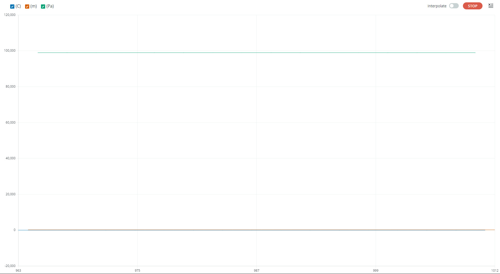

# ICP101xx Arduino library
This arduino library for the [TDK/Invensense ICP101xx MEMS Barometric Pressure sensors](https://invensense.tdk.com/products/1-axis/icp-101xx/).
The ICP-101xx pressure sensor provides a high-accuracy, low power, barometric pressure and temperature sensor solution, that integrates a capacitive pressure sensor for monitoring pressure changes in the range of 30 to 110 kPa.
This library supports ICP-101xx devices, including ICP-10125 for underwater pressure measurement (See doc/AN-000210-ICP-10125-Waterproof-Pressure-Sensor-Integration-Guidelines_v1.2.pdf for sensor mechanical integration).

# Software setup
Use Arduino Library manager to find and install the ICP101xx library.

# Hardware setup
There is currenlty no Arduino shield for the ICP-101xx sensors.
The wiring must be done manually between the Arduino motherboard and the ICP-101xx eval board.
The below wiring description is given for an Arduino Zero board, it depends on the interface to be used:
* I2C

|Arduino Zero|ICP-101xx eval board|
| --- | --- |
| 5V             | CN1.19         |
| GND            | CN1.11         |
| SDA (see Note) | CN1.18         |
| SCL (see Note) | CN1.16         |

Note: For the ICP101xx, SDA and SCL voltage levels are 1.8V, which is not supported by the Arduino Zero. A level shifter is thus required to convert 1.8V levels into 3.3V.

# Library API

## Create ICP101xx instance

**ICP101xx(TwoWire &i2c)**

Create an instance of the ICP101xx that will be accessed using the specified I2C. The I2C address will be the default 0x63.

```C++
ICP101xx ICP(Wire);
```

**ICP101xx(TwoWire &i2c,bool address_bit)**

Create an instance of the ICP101xx that will be accessed using the specified I2C. The I2C address will be the default 0x64 if address_bit is true.

```C++
ICP101xx ICP(Wire,1);
```

## Initialize the ICP101xx
Call the begin method to execute the ICP101xx initialization routine. 

**int begin()**

Initializes all the required parameters in order to communicate and use the ICP-101xx sensor.

```C++
ICP.begin();
```

## Start sensor

**int start()**

This method configures and starts the sensor in low noise mode (ODR=40Hz).

```C++
ICP.start();
```


**int getData(float&ast; pressure, float&ast; temperature)**

This method gets the measured pressure (in Pascal) and temperature (in C degree).
This method blocks until a measurement is available or until the 25ms timeout.
The function returns 0 if a measure was available, non-value if not.

```C++
float pressure_Pa,temperature_C;
if(ICP.getData(&pressure_Pa,&temperature_C) == 0)
{
    Serial.print("Pressure:");
    Serial.println(pressure_Pa);
    Serial.print("Temp:");
    Serial.println(temperature_C);
}
```

## Conversion functions
**float convertToHeight(float pressure_p, float temperature_C)**

This helper function estimates the height from the measured pressure and temperature.
Pressure is in Pascal and temperature in Celsius degree.
The function returns the estimated height in meters.

**float convertToPressure(float height_m, float temperature_C)**

This helper function estimates the pressure at provided height and temperature.
Height is in meters and temperature in Celsius degree.
The function returns the estimated pressure in Pascal.

**float convertToDepth(float pressure_p)**

This helper function estimates the underwater depth from the measured pressure.
Pressure is in Pascal.
The function returns the estimated depth in meters.

# Available Sketches

**Polling_I2C**

This sketch initializes the ICP101xx with the I2C interface, and starts logging pressure, temperature data and corresponding height or depth. Sensor data can be monitored on Serial monitor or Serial plotter.

# Arduino Serial Plotter

When the ICP101xx is logging, the pressure, the temperature and the corresponding height/depth estimation can be monitored with the Arduino Serial Plotter (Tools->Serial Plotter).


